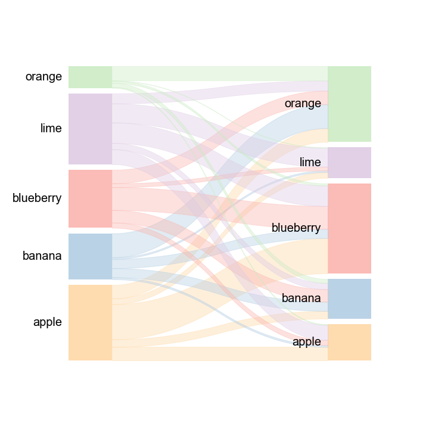

# pySankey2
pySankey2 was developed to draw static Sankey diagrams based on matplotlib. 

While the original version of [pysankey](https://github.com/anazalea/pySankey) was developed by anazalea et al. , this version only supports 2-layer Sankey diagrams, and the settable parameters are limited. pySankey2 expands the original version's functions to support multi-layer Sankey diagrams and allows user to set parameters more flexibly.

## Installation

- v0.1.0

pysankey2-v0.1.0 is available at [here](https://github.com/SZJShuffle/pySankey2/releases/download/v0.1.0/pysankey2-0.1.0.zip), you can install locally via pip cmd after downloading:

```
pip install pysankey2-0.1.0.zip
```

- Development version

```
pip install git+https://github.com/SZJShuffle/pySankey2.git
```

## Usage

### Example1:Two-layer 

Using a 2-layer demo `fruits.txt`:

| layer1    | layer2    |
| --------- | --------- |
| blueberry | blueberry |
| apple     | blueberry |
| ...       | ...       |
| orange    | orange    |

and just with a simple code:

```
import matplotlib.pyplot as plt
import pandas as pd
from pysankey2.datasets import load_fruits
from pysankey2 import Sankey

df = load_fruits()
sky = Sankey(df,colorMode="global")
fig,ax = sky.plot()
```


Setting the strip color to be the same with left box is also allowed:

```
import matplotlib.pyplot as plt
import pandas as pd
from pysankey2.datasets import load_fruits
from pysankey2.utils import setColorConf
from pysankey2 import Sankey

df = load_fruits()
fruits = list(set(df.layer1).union(set(df.layer2)))

# Specified the colors.
# Here, we use 'Pastel1' colormaps(a shy but fresh palette:)).
# See matplotlib cmap for more colormaps:
# https://matplotlib.org/3.1.0/tutorials/colors/colormaps.html
colors = setColorConf(len(fruits),colors='Pastel1')
cls_map = dict(zip(fruits,colors))

# set stripColor="left" 
sky = Sankey(df,colorDict=cls_map,colorMode="global",stripColor='left')

# set a bigger font size 
fig,ax = sky.plot(text_kws={'size':20})
```

we get:



### Example2:Multi-layer

Using a 3-layer demo `countrys.txt`:

| layer1  | layer2 | layer3 |
| ------- | ------ | ------ |
| China   | Canada | USA    |
| England | China  | Japan  |
| ...     | ...    | ...    |
| Senegal | Spain  | USA    |

and with a simple code:

```
from pysankey2 import Sankey
from pysankey2.datasets import load_countrys

df = load_countrys()
sky_auto_global_colors = Sankey(df,colorMode="global")
fig,ax = sky_auto_global_colors.plot()
```

we get:


### Tutorial

For a more detailed tutorial, please refer to:[pysankey2_demo](https://github.com/SZJShuffle/pySankey2/blob/master/example/pySankey2_demo.ipynb)


## Contact

Any  questions, bugs or suggestions are welcome, please feel free to contact: szjshuffle@foxmail.com