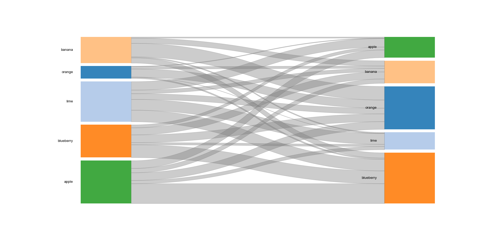
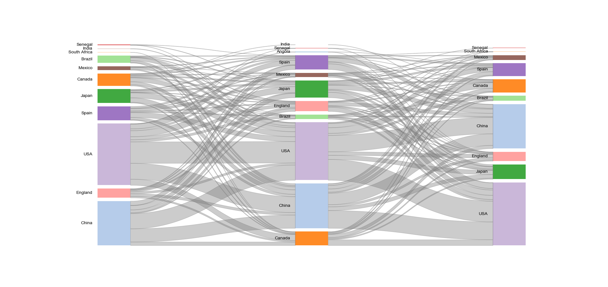

# pySankey2
Static sankey diagrams with matplotlib. 


## Example1:Two-layer 

Using a 2-layer demo `fruits.txt`:

| From      | To        |
| --------- | --------- |
| blueberry | blueberry |
| apple     | blueberry |
| ...       | ...       |
| orange    | orange    |

and with a simple code:

```
import matplotlib.pyplot as plt
import pandas as pd
from pysankey2 import Sankey

df = pd.read_csv("./pysankey2/test/data/fruits.txt",
				sep=" ",
				header=None,
				names=['From', 'To'])
sky = Sankey(df,colorMode="global")
fig,ax = sky.plot()
```

we get:



## Example2:Multi-layer

Using a 3-layer demo `countrys.txt`:

| layer1  | layer2 | layer3 |
| ------- | ------ | ------ |
| China   | Canada | USA    |
| England | China  | Japan  |
| ...     | ...    | ...    |
| Senegal | Spain  | USA    |

and with a simple code:

```
import matplotlib.pyplot as plt
import pandas as pd
from pysankey2 import Sankey

df  = pd.read_csv("./pysankey2/test/data/countrys.txt",sep="\t",header=None,names=['First', 'Mid','Last'])
sky = Sankey(df,colorMode="global")
fig,ax = sky.plot()
plt.show()
```

we get:




## Contact

Any  questions, bugs and suggestions are welcome, please feel free to contact:szjshuffle@foxmail.com